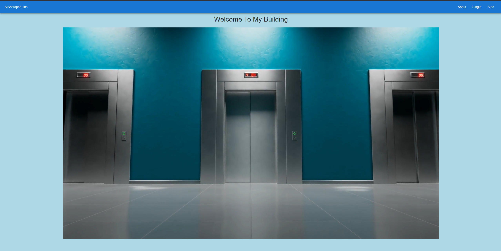
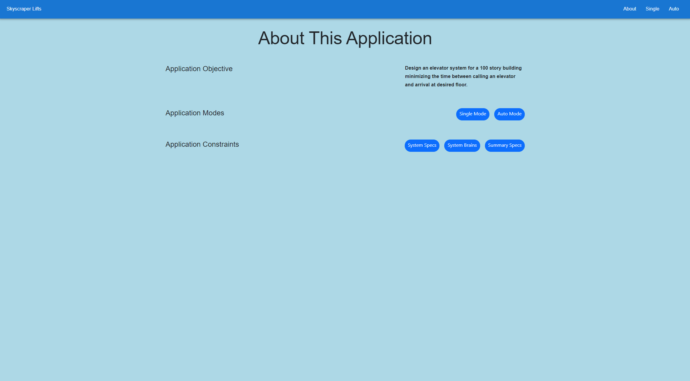
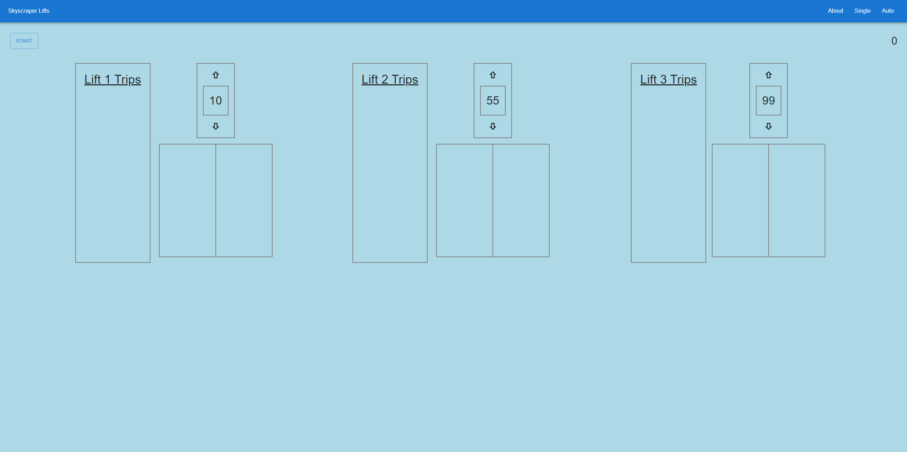

# **_Skyscraper Lifts_**

---

## Application Startup

- clone this repo to your local machine
- cd into project root directory
- npm install
- npm start

---

## Links:

- Deployed app => https://skyscraper-lifts.netlify.app/
- Github repo => https://github.com/JamesFThomas/skyscraper-lift

## Screen Shots

- Home Page
  -- This is the landing page for the application, it displays a looping video with an elevator theme.
  

- About Page
  -- This page is a visual display of the original prompt and all the constraints I followed to build this application.
  

- Single Page
  -- This page is a manual representation of a single elevator car, in a 100-floor building, with 3 different interaction phases (Call, Select, Riding).
  

- Auto Page
  -- This page is a simulated representation of a 3-car elevator system, in a 100-floor building. It utilizes Redux state management and thunk middleware to automatically assign calls to 1 of the 3 cars. Each lift will display trip data that includes the ride phase as well as the start and end floors.
  

---

## Back Story

This project was the first take home skills assessment given to me by a potential employer. For my first attempt at this challenge, I created a series of javascript functions in a single file that logged specific messages to the console to indicate what stage of the ride was currently being completed for each of the three lifts. It got crowded at times but I felt really good about the fact that I got it to work. Unfortunately when I attempted to use the same functions to to power the basic frontend I'd built to showcase my creation, there was a glitch in functionality that resulted in rendered numbers being off and ultimately me not receiving the job.

My inability to complete this project became a blow to my confidence starting out as developer. I later learned this project is far from basic, nor very frontend intensive, and I'm using it's completion as a milestone achievement symbolizing the growth in my skills from a beginner to a mid level developer.

My objectives with this project became to improve my:

- understanding of react framework
- state management skills utilizing redux
- unit testing skills utilizing jest / react testing library
- familiarity with MUI components

---

## Original Take Home Prompt:

Design an elevator system for a skyscraper with 100 floors minimizing the amount of time spent between calling an elevator and arriving at the destination floor.

**Part A =>**

- Implement one or more functions that takes as input a time series of elevator calls and destinations and outputs a time series of elevator actions.

###### <ins> Constraints: </ins>

- There are 3 elevator shafts.
- The destination floor is known at the time of the elevator call.
- There is a lobby on the 1st floor.
- It takes 1 second for the elevator to move 1 floor.
- It takes 30 secs in lobby/5 seconds on any other floor to pick-up/drop-off passenger.
- A maximum of 10 people can fit into the elevator car at any one time.

**Part B =>**

- Implement a simulator that generates the time series of elevator calls to feed the function in part A.

###### <ins> Constraints: </ins>

- Except for the lobby, all other floors have a uniform distribution of number and frequency of calls.
- The number of passengers per call is random according to a lognormal distribution, rounded to the nearest integer in the range (0, 5).
- The random functions should be seeded in such a way that the results of any run can be reproduced if the same seed is used.

**Part C =>**

- After the simulator runs, it should produce summary statistics.

###### <ins> Statistics: </ins>

- The average time spent waiting for an elevator.
- The average time spent inside an elevator.
- The average total time spent per trip.

---

## Testing

Within the testing suites of this application, I practiced the AAA pattern ( Arrange, Act, Assert ), covering the happy path first ( Does this component render? ) and then increased test complexity. The articles I used to help me write better tests are below.

- Jest testing like a pro => https://dev.to/dvddpl/jest-testing-like-a-pro-tips-and-tricks-4o6f
- How to Write Good Unit Tests => https://leanylabs.com/blog/good-unit-tests/
- Why good developers write bad code => https://mtlynch.io/good-developers-bad-tests/
