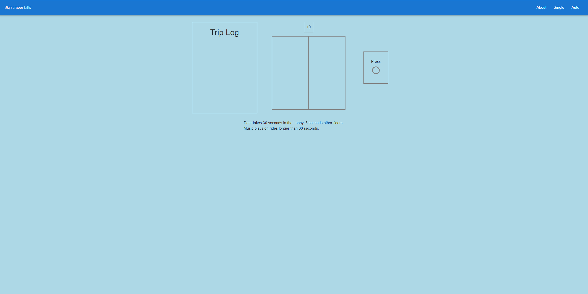

# Project Title

### **_Skyscraper Lifts_**

---

## Application Startup

- clone this repo to your local machine
- cd into project root directory
- npm install
- npm start

---

## Links:

- Deployed app => https://skyscraper-lifts.netlify.app/
- Github repo => https://github.com/JamesFThomas/skyscraper-lift

## Screen Shots

- Home Page
  

- About Page
  

- Single Page
  

- Auto Page
  

---

## Back Story

- This project was the first take home skills assessment a potential employer gave me. For my first attempt at this challenge I created a series of javascript functions in a single file, that logged specific messages to indicate what stage of the ride currently being completed.

---

## Application Objective

- Design an elevator system for a skyscraper with 100 floors minimizing the amount of time spent between calling an elevator and arriving at the destination floor.

  ### Part A =>

  - Implement one or more functions that takes as input a time series of elevator calls and destinations and outputs a time series of elevator actions.
    #### <ins> Constraints: </ins>
    - There are 3 elevator shafts.
    - The destination floor is known at the time of the elevator call.
    - There is a lobby on the 1st floor.
    - It takes 1 second for the elevator to move 1 floor.
    - It takes 30 secs in lobby/5 seconds on any other floor to pick-up/drop-off passenger.
    - A maximum of 10 people can fit into the elevator car at any one time.

  ### Part B =>

  - Implement a simulator that generates the time series of elevator calls to feed the function in part A.
    #### <ins> Constraints: </ins>
    - Except for the lobby, all other floors have a uniform distribution of number and frequency of calls.
    - The number of passengers per call is random according to a lognormal distribution, rounded to the nearest integer in the range (0, 5).
    - The random functions should be seeded in such a way that the results of any run can be reproduced if the same seed is used.

  ### Part C =>

  - After the simulator runs, it should produce summary statistics.
    #### <ins> Statistics: </ins>
    - The average time spent waiting for an elevator.
    - The average time spent inside an elevator.
    - The average total time spent per trip.

---

## Testing

- articles I used to help me write great better tests
  - Jest testing like a pro => https://dev.to/dvddpl/jest-testing-like-a-pro-tips-and-tricks-4o6f
  - How to Write Good Unit Tests => https://leanylabs.com/blog/good-unit-tests/
  - Why good developers write bad code => https://mtlynch.io/good-developers-bad-tests/
